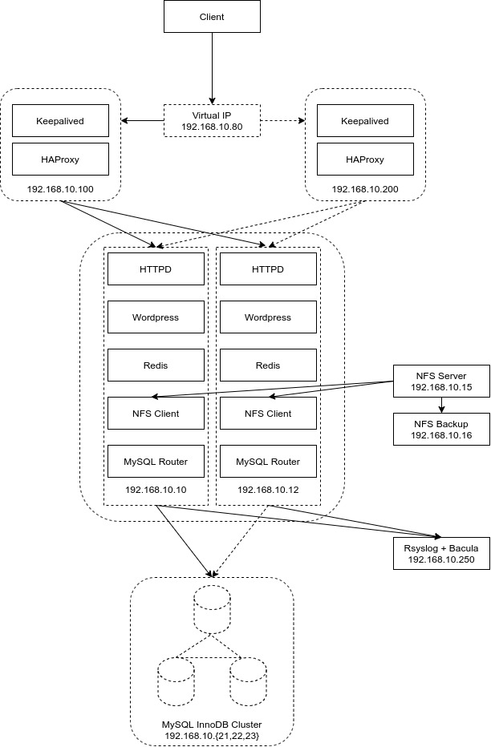

# Итоговый проект по курсу «Администратор Linux»

### Общая информация

Проект представляет собой высокодоступный кластер для Wordpress с использованием кластера MySQL InnoDB.

Для разворачивания проекта используется Vagrant и Ansible.

### Образ решения

На основном сервере располагаются Wordpress, Apache, Redis и MySQL Router. Здесь же примонтированы nfs папки для хранения файлов wordpress. В целях отказоустойчивости данный сервер продублирован. Для сбора логов развернута отдельная машина. Она же используется для снятия бэкапов с основного сервера посредством Bacula.

Балансировку нагрузки на эти серверы осуществляет HAProxy, также расположенный на двух серверах. Отказоустойчивость серверов HAProxy обеспечивает Keepalived с настроенным виртуальным IP-адресом.

В качестве общего хранилища данных используется NFS Server, развернутый на отдельном сервере. Дополнительно, на отдельной машине информация с NFS сервера ежедневно копируется и архивируется.

Для обеих копий Wordpress используется InnoDB Cluster, развернутый на отдельном кластере.

Также для обеих копий Wordpress используются отдельностоящие сервера Redis.

### Схема проекта

## Запуск, настройка и проверка работоспособности проекта

1. Выполнить в каталоге с проектом команду `vagrant up`. Виртуальные машины будут развернуты с помощью Vagrant, а настройка будет произведена с помощью Ansible.

2. После того, как все машины будут подняты и настроены, необходимо в браузере зайти на виртуальный ip адрес `http://192.168.10.80`.

3. Далее необходимо зарегистрировать администратора приложения и создать свою первую страницу или пост в Wordpress.

## Высокодоступность

В случае падения одного из основных серверов приложение продолжит работу.
В случае падения одной из машин с HAProxy приложение продолжит работу.
В случае падения одной из нод MySQL InnoDB Cluster приложение так же продолжит свою работу.

============[updated v.02]===============
Изменено:
- вместо drupal установил wordpress
- зарегистрировал тестового пользователя
- на тестовой странице разместил картинку
- выключил backend01, картинка сохранилась

============[updated v.01]===============
Добавлены 2 ноды:
- nfsserver 10.15
- nfsbackup 10.16

На backend01 / backend02 примонтированы nfs shared directories для файлов drupal (/var/www/html/drupal/site/default/files)

Бэкап файлов осуществляется архивированием и копированием в отдельное хранилище на ноде nfsbackup по заданию в cron ежедневно.

============[к защите]===============
haproxy01 10.100 / haproxy02 10.200 (haproxy, keepalived)  ---    monitoring 10.250 (rsyslog, bacula)

backend01 10.10 / backend02 10.12 (httpd, php, drupal, redis, mysql-router)

sqlnode01 10.21 / sqlnode02 10.22 / sqlnode03 10.23 (innodb cluster)

В браузере:
192.168.10.80  (установка drupal)
192.168.10.80:5000/stat/  (посмотреть статистику haproxy  stat/statpass)

На backend01:
`mysqlsh
shell.connect('cluster@127.0.0.1:6446', 'pass123!')
mcdba.getCluster().status()
#/etc/rsyslog.d/*.conf по отправке логов
#redis-cli ping
PONG
#redis-cli
set mykey somevalue
get mykey
keys *
/var/log/redis/redis-server.log`

На sqlnode01:
`mysql -p
pass -- r7pCM8}t!J{1GcI&
show databases;
use drupaldb;
show variables;
create database NAME;
drop database NAME;`

На monitoring:
`cd /var/log/{название ноды}/logs
bconsole
*status dir
*run
*restore`